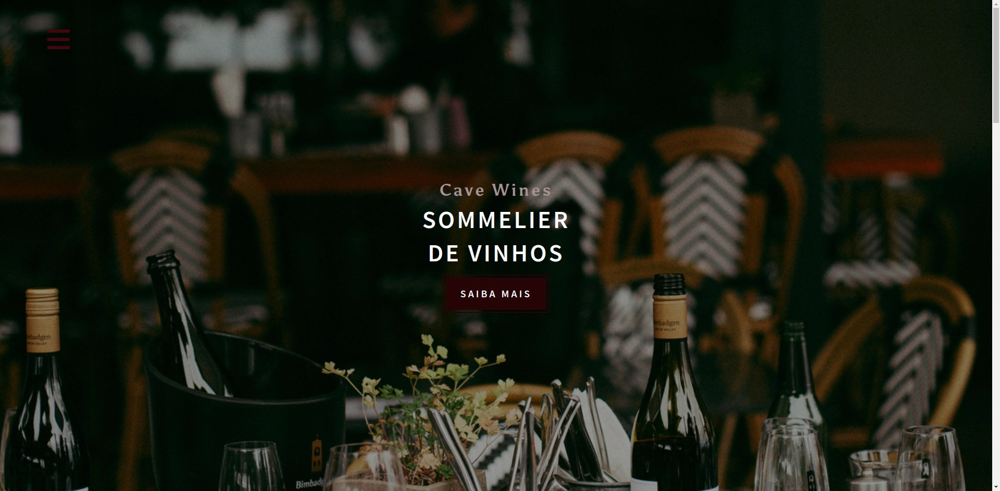

<h2 align="center">Cave Wines</h2>
<h1 align="center">SOMMELIER <br> DE VINHOS</h1>

<p align="center">
  <a href="#-technologies">Technologies</a>&nbsp;&nbsp;&nbsp;|&nbsp;&nbsp;&nbsp;
  <a href="#-layout">Getting started</a>&nbsp;&nbsp;&nbsp;|&nbsp;&nbsp;&nbsp;
  <a href="#-project">Project</a>&nbsp;&nbsp;&nbsp;|&nbsp;&nbsp;&nbsp;
  <a href="#-layout">Layout</a>&nbsp;&nbsp;&nbsp;&nbsp;&nbsp;&nbsp;
</p>

<br>

<p align="center">
  
</p>

<br>

## 🧪 Technologies

This project was developed using the following technologies:

- HTML
- CSS
- JavaScript

A simple project to practice learning

<br>

## 🚀 Getting started

Clone the project and access the folder.

```bash
$ git clone https://github.com/alanopaixao/loja-de-vinhos.git && cd loja-de-vinhos
```
<br>

## 💻 Project

This is a project developed through the HTML and CSS course at **[John Smilga](https://www.johnsmilga.com/)**, avaliable on the  **[Udemy](https://www.udemy.com/course/in-depth-html-css-course-build-responsive-websites/)** plataform.

<br>

## 🔖 Layout

You can consult the project through the link below:

- [Loja de Vinhos](https://loja-de-vinhos.netlify.app/) 


Just click and access the page :)

---

<p align="center">Made with ❤️ by Alan Paixão